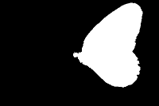
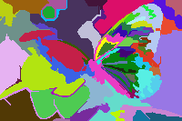
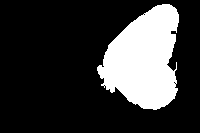
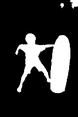
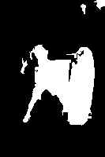
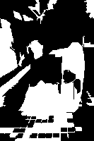

## 1. Seam Carving

> 实现Seam Carving 算法，设计并实现前景保持的图像缩放（前景已标注）

测试结果：

左图是原图，中间是标记后的图，尺寸为200\*133；右图是进行裁剪后的图，尺寸为110\*90

           <!--块级封装-->
    
    <!--将图片和文字居中-->
    
            
        ==>
            
    

## 2.

> 基于 Graph-based image segmentation 方法，通过设定恰当的阈值将每张图分割为 50~70 个区域，同时修改算法要求任一分割区域的像素个数不能少于 50 个（即面积太小的区域需与周围相近区域合并）。结合给定的前景 mask，将每一个分割区域标记为前景（区域 50%以上的像素在 mask中标为 255）或背景（50%以上的像素被标为 0）。对测试图像子集生成相应处理图像的前景标注并计算生成的前景 mask 和 GT 前景 mask 的 IOU 比例。（假设生成的前景区域为 R1，该图像的给定前景区域为 R2，则 IOU =$\frac{R1\cap R2}{R1\cup R2}$）

测试结果：

左1是原图，左2是被区域划分后的图；右2是原背景标记图，右1是区域标记后的图。

           <!--块级封装-->
    
    <!--将图片和文字居中-->
    
    
        
        
    

IOU结果:

| k   | number of regions | IOU                |
|---- | ----------------- | ------------------ |
|350  | 65                | 0.9484173505275498 |

## 3

> 从训练集中随机选择 200 张图用以训练，对每一张图提取归一化 RGB颜色直方图（8\*8\*8=512 维），同时执行问题 2 对其进行图像分割， （分割为 50~70个区域），对得到的每一个分割区域提取归一化 RGB 颜色直方图特征（维度为8\*8\*8=512），将每一个区域的颜色对比度特征定义为区域颜色直方图和全图颜色直方图的拼接，因此区域颜色区域对比度特征的维度为 2*512=1024 维，采用PCA 算法对特征进行降维取前 20 维。利用选择的 200 张图的所有区域（每个区域 20 维特征）构建 visual bag of words dictionary，单词数（聚类数）设置为 50 个，visual word 的特征设置为聚簇样本的平均特征，每个区域降维后颜色对比度特征（20 维）和各个 visual word 的特征算点积相似性得到 50 个相似性值形成 50 维。将得到的 50 维特征和前面的 20 维颜色对比度特征拼接得到每个区域的 70 维特征表示。根据问题 2，每个区域可以被标注为类别 1（前景：该区域 50%以上像素为前景）或 0（背景：该区域 50%以上像素为背景），选用任意分类算法（SVM，Softmax，随机森林，KNN等）进行学习得到分类模型。最后在测试集上对每一张图的每个区域进行测试（将图像分割为 50~70 个区域，对每个区域提取同样特征并分类），根据测试图像的GT，分析测试集区域预测的准确率。

测试结果：

左图是原背景标记图，中间的是划分区域后标记的图；右图是预测的前景标记图，区域预测标记结果准确率为 0.6923076923076923。

           <!--块级封装-->
    
    <!--将图片和文字居中-->
        
    
        
    

## 4. PCA

> PCA 压缩。先将图片尺寸缩放或裁减为 12的倍数，以 12*12 patch 为单位执行 PCA 压缩，
>
> 1）展示 16 个最主要的特征向量的可视化图，
>
> 2）展示 144D，60D，16D 和 6D 的压缩结果。

测试结果：

#### 压缩结果

对测试图进行降维分析:

16 个最主要的特征向量：

可以很明显地看到，当保留的维数越少时，恢复后的图像也就越模糊，每个块之间的差异也越来越小：

144D							60D	

16D   							6D      